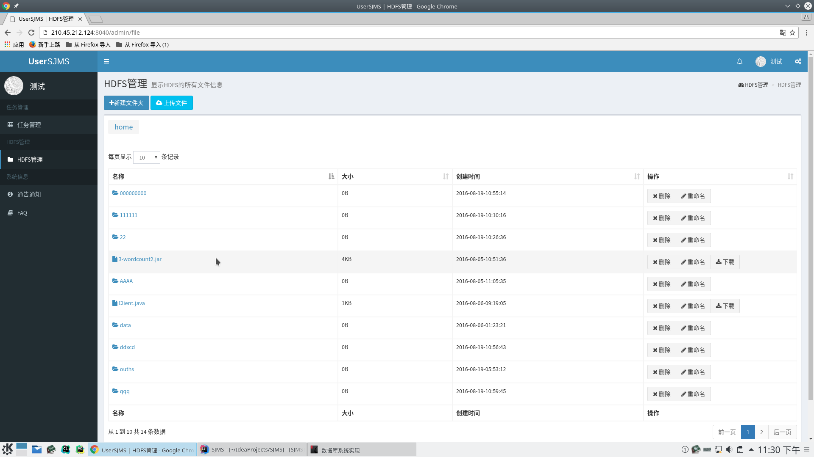
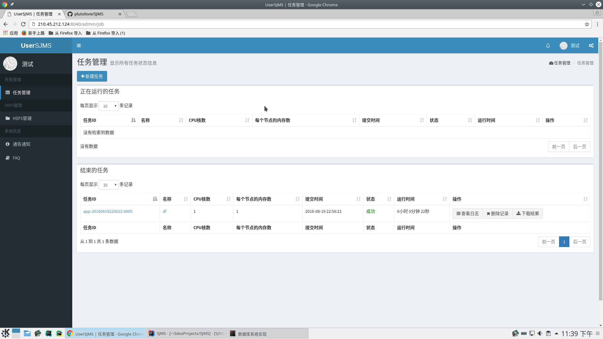
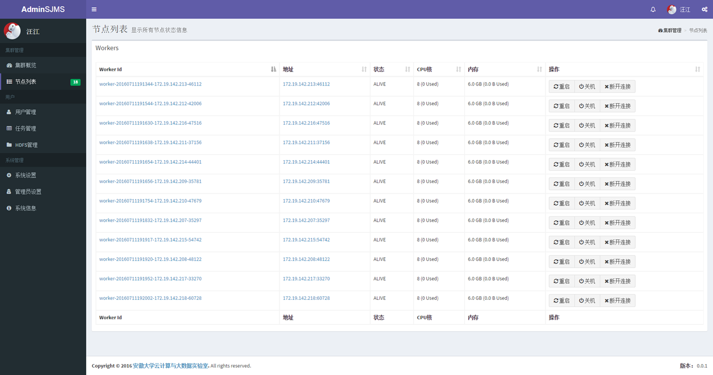
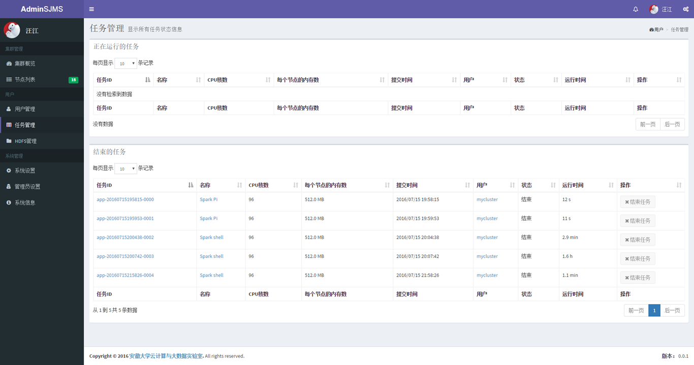
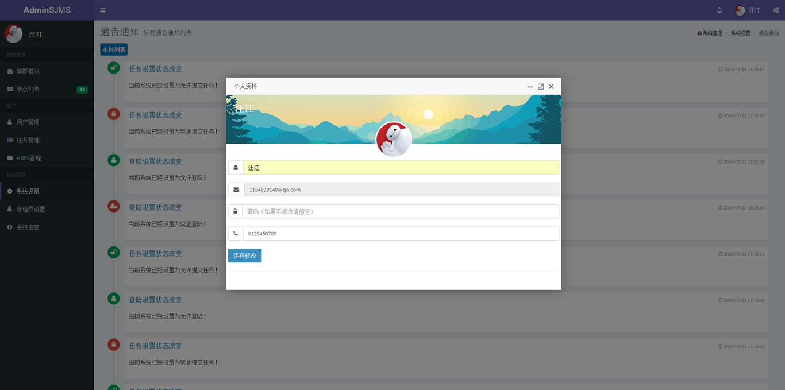
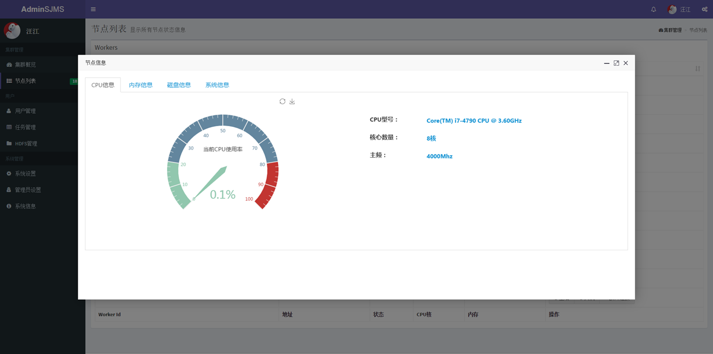

## 项目介绍
#### 简要概述：
AdminSJMS(Admin Spark Job Manager System) 是一个基于Spark的Job管理软件，你可以通过它管理Spark平台的任务和所有节点。
本软件可以给所有用户分配HDFS(Hadoop Distributed File System)空间，用户可以操作自己的HDFS文件，并将文件的位置作为Spark任务的数据输入路径。
本项目是SJMS(Spark Job Manager System)的一个子项目，SJMS项目还包括一个提供给用户的一个Job的提交软件，以及提供Spark和HDFS相关操作的接口的软件。
本项目所有软件基于MIT协议开源，开源的相关细节可以在最下面的"许可"看到。

#### 项目功能及特点：
>* 直观简洁的页面
>* 管理Spark集群的状态
>* 管理任务列表
>* 管理集群的所有节点
>* 完备的HDFS操作
>* 轻松管理用户及用户的任务
>* 提供相应的系统设置

#### 详细介绍：
软件的相关截图和描述:
#####HDFS文件系统：对HDFS的各种操作

#####Spark作业提交：提交作业和显示作业状态等概览

#####集群概览：显示集群当前的概览情况

#####节点列表：显示所有节点状态信息

#####任务管理：显示所有任务状态信息

#####通告通知：所有通告通知列表

#####个人信息：显示和修改个人信息

#####节点管理：显示节点状态信息

## 项目构建

本软件基于了一些开源的软件，在这里感谢开源社区的力量。下面是我们使用的一部分开源软件:

> [Jquery](https://github.com/jquery/jquery) by [jQuery Foundation](https://github.com/jquery)
> [Flot](https://github.com/flot/flot) by [Flot](https://github.com/flot)
> [admin-lte](https://github.com/almasaeed2010/AdminLTE) by [Abdullah Almsaeed](https://github.com/almasaeed2010)
> [sigar](https://github.com/hyperic/sigar) by [Hyperic](https://github.com/hyperic)
> [JFinal](https://git.oschina.net/jfinal/jfinal) by [JFinal](https://git.oschina.net/jfinal)